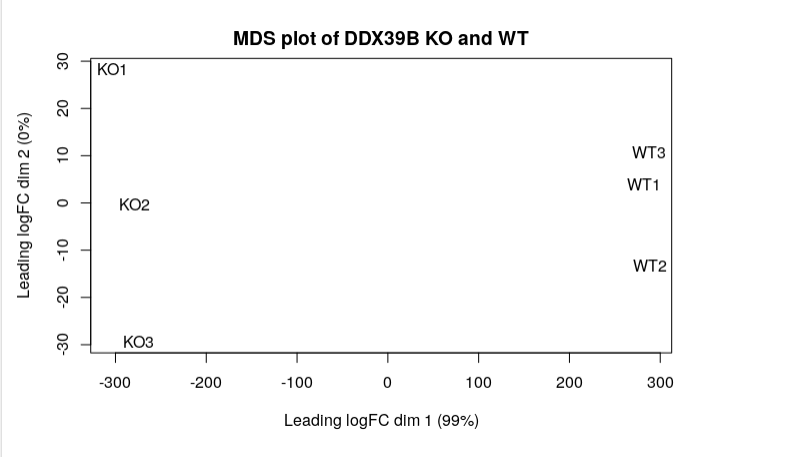

# Introduction

RNA processing events include transcription, mRNA splicing, and Export.
In the cell, these RNA processing events are coordinated by the TREX complex.
The essential subunit of the TREX complex is DDX39B. This paper explores function of the DDX39B complex in handling damaged DNA.
The DDX39B complex facilitates DNA repair by up-regulating BRCA1 by binding to it, and stabilizing it.This	ensures ssDNA formation and RAD51 accumulation at the double stranded break sites.
Hence, the DDX39B complex handles damaged DNA by maintaining BRCA1 levels. <\br>
Without DDX39B ovarian cancer cells have hypersensitivity to DNA-damaging chemotherapeutic and are more likely to have damaged DNA.
High DDX39B expression is correlated with worse survival in ovarian cancer patients since it protects the cells from DNA damage. 
DDX39B suppression represents a target for enhancing the efficacy of chemotherapy in BRCA1-proficient ovarian cancers. The paper has found that lacking DDX is like lacking BRCA1 which prevents the cells from repairing their broken DNA. <\br>
DDX39B depletion sensitizes cancer cells to DNA damaging agent including chemotherapy. The experiment in this paper used HeLA cells and performed Knockout of DDX39B complex genes on 3 knockout samples. The researchers then checked response to chemo agents. They discovered less survival as compared to wild type cells. <\b>
Following the loss of DDX39B, the researchers persormed transcriptome profiles. They preformed mRNA sequencing in both wild-type and DDX39B knockout HeLa cells. <\br>
Among the genes that are regulated by DDX39B deficiency, 1483 genes were found to be upregulated and 1272 genes were down-regulated. Importantly, BRCA1, which is a key player in DNA damage repair, was significantly downregulated in DDX39B-depleted cells. 

The researchers also performed qPCR and western blot to confirm that BRCA1 both the mRNA and protein levels were decreased in DDX39B knock out HeLa cells. Researchers also found that the regulation on BRCA1 is specific to DDX39B and no other DDX homologues.
All in all, these data suggest that DDX39B participates in DNA repair pathway via upregulating BRCA1 at the mRNA level. <\br>
KO: DDX knockout genes <\br>
WT: wild type <\br>

 
 
```{r eval=FALSE}
if (!requireNamespace("BiocManager", quietly = TRUE))
    install.packages("BiocManager")
if (!requireNamespace("GEOmetadb", quietly = TRUE))
    BiocManager::install("GEOmetadb")
if(!requireNamespace("knitr", quietly=TRUE))
  install.packages("knitr")
if(! requireNamespace("edgeR", quietly=TRUE))
  BiocManager::install("edgeR")
if (!requireNamespace("GEOquery", quietly=TRUE))
  BiocManager::install("GEOquery")
if (!requireNamespace("biomaRt", quietly = TRUE)){
  install.packages("biomaRt")}
if (!require("BiocManager", quietly = TRUE))
    install.packages("BiocManager")
if (!require("stringr", quietly = TRUE))
    install.packages("stringr")
if (!require("dplyr", quietly = TRUE))
    install.packages("dplyr")

if (!require("Biobase", quietly = TRUE))
    install.packages("Biobase")

if (!require("kableExtra", quietly = TRUE))
    install.packages("kableExtra")
if( !file.exists("GEOmetadb.sqlite") ) {
    demo_sqlfile <- getSQLiteFile(destdir = getwd(), destfile = "GEOmetadb.sqlite.gz", type = "demo")
} else {
    demo_sqlfile <- "GEOmetadb.sqlite"
    
}

if (!require("magrittr", quietly = TRUE))
    install.packages("magrittr") # package installations are only needed the first time you use it


```

```{r eval=FALSE}
library(dplyr)
library(magrittr)
library(knitr)
library(Biobase)
library(GEOmetadb)
library(biomaRt)
library(ComplexHeatmap)
library(circlize)
library(edgeR)

``` 
 
# ASSIGNMENT 1 Redo 

Since the data analysis performed in assignment 1 was not useful for the analysis 
in this assignment, the following section includes cleaning and normalisation of data
from assignment 1. 

First, I downloaded the GEOmetaDB, and got access to the meta data:

## Download the data:
```{r message=FALSE}
#if the file exists, open it
fnames <- "GSE156543/GSE156543_Raw_gene_counts_matrix.txt.gz"

if (! file.exists(fnames)){
  gse <- GEOquery::getGEO("GSE117452", GSEMatrix=FALSE)
  sfiles = GEOquery::getGEOSuppFiles("GSE156543")
  fnames = rownames(sfiles)
}
```

## Geo Description of dataset:
```{r message=FALSE}
gse <- GEOquery::getGEO("GSE156543",GSEMatrix=FALSE)
data.frame(head(GEOquery::Meta(gse)))
knitr::kable(data.frame(head(GEOquery::Meta(gse))), format = "html")
```

Platform title:
```{r warning=FALSE}
current_gpl <- names(GEOquery::GPLList(gse))[1]
current_gpl_info <- GEOquery::Meta(GEOquery::getGEO(current_gpl))
```


**Platform title:** `r current_gpl_info$title`<br /> **Submission data:**`r current_gpl_info$submission_date` <br/> **Last Update data:** `r current_gpl_info$last_update_date` <br/> **Organism:** `r current_gpl_info$organism` <br/> **Number of GEO datasets using this technology:** `r length(current_gpl_info$series_id)` <br/> **Number of GEO samples that use this technology:**`r length(current_gpl_info$sample_id)`<br/>


## Getting the expression data 
```{r message=FALSE}
DDX39B_exp = read.delim(fnames[1],header=TRUE, check.names = FALSE) 

knitr::kable(DDX39B_exp[1:5,], format = "html")

```

## cleaning the data:
I have unique ENSG IDs, so I will not filter them
```{r}
dim(DDX39B_exp) 
#58381 rows, 6 col
colnames(DDX39B_exp) 
#(3 KO and 3 WT)

rownames(DDX39B_exp) 
if("ensemble_ID" %in% colnames(DDX39B_exp))
{
  ;
}else{
  DDX39B_exp <- tibble::rownames_to_column(DDX39B_exp, "VALUE")
  colnames(DDX39B_exp) <- c("ensemble_ID", "KO1", "KO2", "KO3", "WT1", "WT2", "WT3")

}

summarized_gene_counts <- sort(table(DDX39B_exp$ensemble_ID), decreasing = TRUE)
knitr::kable(table(DDX39B_exp[, 1])[1:3], format="html")

```


## Gene name structure
Removing genes that do not follow ensembl nomenclature

```{r}
#check that all ensg are unique and all start with ENSG pattern 
areUniquegenes <- length(DDX39B_exp$ensemble_ID) == length(unique(DDX39B_exp$ensemble_ID))
allValidGenes <- length(grep("ENSG.*", DDX39B_exp$ensemble_ID)) == length(DDX39B_exp$ensemble_ID)


```


In edgeR, it is recommended to remove features without at least 1 read per million
in n of the samples, where n is the size of the smallest group of replicates.
## Normalisation
```{r}
#removing the versions  
DDX39B_exp <- tidyr::separate(DDX39B_exp, ensemble_ID, into = c("ensemble_ID", "Second"), "[.]")
DDX39B_exp <- DDX39B_exp[, -2]  
  
cpms = edgeR::cpm(DDX39B_exp[,2:7])
rownames(cpms) <- DDX39B_exp$ensembl_id
keep = rowSums(cpms > 1) >= 3 # I have 6 groups, 3 sample replicates and 3 WT replicates
genes_filtered <- DDX39B_exp[keep,]


dim(genes_filtered)
filtered_results <- data.frame(genes_expression = nrow(DDX39B_exp), validGenes = nrow(DDX39B_exp), genes_filtered = nrow(genes_filtered))
rownames(filtered_results)[1] <- "Number of Genes"

```

Data dimension of data and filtered data.
Lots of the data has been filtered in the normalisation process following the edgeR
guidlines. 
```{r}
dim(cpms)
length(which(keep))
```


## Data distribution density plot: 
```{r}
data2plot <- log2(edgeR::cpm(genes_filtered[,2:7]))
counts_density <- apply(log2(edgeR::cpm(genes_filtered[,2:7])), 
 2, density)
 #calculate the limits across all the samples
 xlim <- 0; ylim <- 0
 for (i in 1:length(counts_density)) {
 xlim <- range(c(xlim, counts_density[[i]]$x)); 
 ylim <- range(c(ylim, counts_density[[i]]$y))
 }
 cols <- rainbow(length(counts_density))
 ltys <- rep(1, length(counts_density))
 #plot the first density plot to initialize the plot
 plot(counts_density[[1]], xlim=xlim, ylim=ylim, type="n", 
 ylab="Smoothing density of log2-CPM", 
 main="", cex.lab = 0.85)
 #plot each line
 for (i in 1:length(counts_density)) 
 lines(counts_density[[i]], col=cols[i], lty=ltys[i])
 #create legend
 legend("topright", colnames(data2plot), 
 col=cols, lty=ltys, cex=0.75, 
 border ="blue", text.col = "green4", 
 merge = TRUE, bg = "gray90")
```

Data distribution boxplot: 
```{r}

data2plot <- log2(edgeR::cpm(genes_filtered[,2:7]))
boxplot(data2plot, xlab = "Samples", ylab = "log2 CPM", 
 las = 2, cex = 0.5, cex.lab = 0.5,
 cex.axis = 0.5, main = "CA125 RNASeq Samples")
#draw the median on each box plot
abline(h = median(apply(data2plot, 2, median)), 
 col = "green", lwd = 0.6, lty = "dashed")
```

plotting normalization by distribution method
```{r}
limma::plotMA(log2(DDX39B_exp[,c(4,5)]), ylab="M - ratio log expression", 
 main="DDX39B KO + vs WT sample")
```
# MDS plot of normalised data
```{r}
filtered_data_matrix <- as.matrix(genes_filtered[,2:7])
rownames(filtered_data_matrix) <- genes_filtered$ensemble_ID
d <- edgeR::DGEList(counts=filtered_data_matrix)
d <- edgeR::calcNormFactors(d) 
normalized_counts <- edgeR::cpm(d)
limma::plotMDS(normalized_counts, main="MDS plot of DDX39B KO and WT"
 )
```


```{r}
colnames(normalized_counts)
```

To perform mapping, ensembl_gene_id is selected

 ISSUE: when DDX4 file  exists, I don't get conversion stash
```{r}
ensembl <- biomaRt::useMart("ensembl")
ensembl <- biomaRt::useMart(biomart="ensembl", dataset="hsapiens_gene_ensembl")
conversion_stash <- "DDX4_id_conversion.rds"
if(file.exists(conversion_stash)){
  my_id_conversion <- readRDS(conversion_stash)
} 
gene_mapped <- biomaRt::getBM(attributes = c("ensembl_gene_id","hgnc_symbol"), filters = c("ensembl_gene_id"), values=genes_filtered$ensemble_ID, mart = ensembl)
saveRDS(gene_mapped, conversion_stash)

```

```{r}
genes_filtered$ensemble_ID[1:10]
```


Total number of genes with measurements
```{r}
nrow(cpms)
```
Number of genes that could be mapped
```{r}
nrow(cpms) - length(which(rownames(cpms) %in%
gene_mapped$ensembl_gene_id)) 
```


Merging raw data and mapped genes
```{r}
cpms_annot <- merge(gene_mapped, normalized_counts,
by.x = 1, by.y = 0, all.y=TRUE)
```

Check ensembl ID missing genes. 43 genes missing which
is not too many (only 43) can still run differential analysis.
```{r}
length(ensembl_id_missing_gene <- cpms_annot$ensembl_gene_id[
which(is.na(cpms_annot$hgnc_symbol))])
```

```{r}
write.table(cpms_annot,"./data/GSE156543_finalized_normalized_counts_2023.txt", sep = "\t", col.names = TRUE)


```

# A2 

## Differential Gene Expression: 

**Question1: Revisit your MDS plot from Assignment #1 to demonstrate your choice of factors in your model.** <br/> 
From the MDS model denerated from A1, there is a clear distinction in the Knockout and the 
WildType cells. There is a clear separation between the two groups. Hence, the 
factors used in my model are having knock out of the DDX39B gene or being wild type.
From the MDS plot, there is evidence of the cluster of KO and WT. WT vs KO clusters together is important in determining its value. Hence, Expression is only controlled by WT or KO the origin of the cell does not effect my data as seen in MDS plot.

<br/>



Reading the normalized expression data from assignment 1
```{r}
normalized_count_data <- read.table(file=file.path(getwd(),"data", 
                "GSE156543_finalized_normalized_counts_2023.txt"),
                                    header = TRUE,sep = "\t",
                                    stringsAsFactors = FALSE,
                                    check.names=FALSE)
```

Visualize expression values
```{r}
heatmap_matrix <- normalized_count_data[,
                        3:ncol(normalized_count_data)]
#Row name is Ensemble gene IDs
rownames(heatmap_matrix) <- normalized_count_data$ensembl_gene_id
colnames(heatmap_matrix) <- colnames(normalized_count_data[,
                        3:ncol(normalized_count_data)])
```


Row normalize with scale function
```{r}
library(circlize)
library(ComplexHeatmap)
heatmap_matrix <- t(scale(t(heatmap_matrix)))
if(min(heatmap_matrix) == 0){
    heatmap_col = colorRamp2(c( 0, max(heatmap_matrix)), 
                             c( "white", "red"))
  } else {
    heatmap_col = colorRamp2(c(min(heatmap_matrix), 0, 
          max(heatmap_matrix)), c("blue", "white", "red"))
  }
current_heatmap <- Heatmap(as.matrix(heatmap_matrix),
      show_row_dend = TRUE,show_column_dend = TRUE, 
      col=heatmap_col,show_column_names = TRUE, 
      show_row_names = FALSE,show_heatmap_legend = TRUE)
```

## Heat map for all genes in expression set
Variability at the WT vs sample level. The WT and KO seem to have very different gene expression.
```{r}
current_heatmap
```


Look at expression data and see difference of expression of the genes.
```{r}
knock_out <- normalized_count_data[3:5]
Wild_type <- normalized_count_data[6:8]

```


Due to the very large difference in expression of the WT and KO genes, I did used both limma and edgeR 
packages to perform analysis, and received the same results for my model.
```{r}
samples <- c("KO", "KO", "KO", "control", "control", "control")
```

Expression is only controlled by WT or KO the origin of the cell does not effect my data as seen in MDS plot.
I will design my model matrix based on these two groups from my data.
```{r}
library(knitr)
model_design <- model.matrix(~ samples)
kable(model_design[1:5,], type="html")
```


```{r}
expressionMatrix <- as.matrix(normalized_count_data[,3:8])
rownames(expressionMatrix) <- 
  normalized_count_data$ensembl_gene_id
colnames(expressionMatrix) <- 
  colnames(normalized_count_data)[3:8]
minimalSet <- Biobase::ExpressionSet(assayData=expressionMatrix)
```

Fit data to the model
```{r}
fit <- limma::lmFit(minimalSet, model_design)
```

I then find the top hits for this expression, ordered according to p-value.
Then I perform differential expression associated with the p-values.
Finally, I will get all of the top hits associated with expression and 
use Benjamin Hoffberger method for adjustment. 

```{r}
fit2 <- limma::eBayes(fit,trend=TRUE)
# adjust model for multiple hypothesis testing
topfit <- limma::topTable(fit2, 
                   coef="samplesKO",
                   adjust.method = "BH",
                   number = nrow(expressionMatrix))
#merge hgnc names to topfit table add ENSG and gen ID to output
output_hits <- merge(normalized_count_data[,1:2],
                     topfit,
                     by.y=0,by.x=1,
                     all.y=TRUE)
#sort by pvalue
output_hits <- output_hits[order(output_hits$P.Value),]
```

**Question3: Multiple hypothesis testing - correct your p-values using a multiple hypothesis correction method. Which method did you use? And Why? How many genes passed correction?** <br/> 
The Benjamini-Hochberg method is a widely used method for multiple hypothesis correction. It is used to control the false discovery rate when testing multiple hypotheses simultaneously.
The FDR is the expected proportion of false positives among all the significant results, and the Benjamini-Hochberg method controls this rate by adjusting the p-values for each hypothesis being tested. Specifically, the method sets a threshold for the p-values based on the FDR and rejects all null hypotheses with p-values below this threshold.
By controlling the FDR, the Benjamini-Hochberg method provides a way to account for the increased chance of false positives when testing multiple hypotheses, and helps to reduce the likelihood of making erroneous conclusions based on random chance.
(source: Benjamini, Y., & Hochberg, Y. (1995). Controlling the false discovery rate: A practical and powerful approach to multiple testing. Journal of the Royal Statistical Society: Series B (Methodological), 57(1), 289-300.)

Get our top 10 hits, including the p-values, hgnc symbol names, logFC between WT and KO states
Avg expression, t-value for t-test, p-value, and adjusted p-value
```{r}
kable(output_hits[1:10,2:8],type="html",row.names = FALSE)

```


**Question2: Calculate p-values for each of the genes in your expression set. How many genes were significantly differentially expressed? What thresholds did you use and why?** <br/> 
  <br/>
 Almost all of the genes are differentially expressed between the KO and WT subgroups. Hence, since 
 the samples are very different and there is a lot of differential expression in the data, I will
 filter the output hits for more stringent adjusted p-values. I do this since I am looking for strongest signals so I need to define a more stringent signal to get those strongest signals. In order to bottleneck the 
 genes to those with the strongest signal, I used an adjusted p-value of 0.000000001. With this
 threshold, 1007 genes are significantly differentially expressed between the KO and WT genes.

Number of genes that pass the correction and are corrected for randomness
```{r}
length(which(output_hits$adj.P.Val < 0.000000001))

```

Heatmap for just significant differential expressed genes
```{r}
#adjusted p-value less than 0.000000001
top_hits <- output_hits$ensembl_gene_id[
  output_hits$adj.P.Val<0.000000001]
heatmap_matrix_tophits <- t(
  scale(t(heatmap_matrix[
    which(rownames(heatmap_matrix) %in% top_hits),])))
if(min(heatmap_matrix_tophits) == 0){
    heatmap_col = colorRamp2(c( 0, max(heatmap_matrix_tophits)), 
                             c( "white", "red"))
  } else {
    heatmap_col = colorRamp2(c(min(heatmap_matrix_tophits), 0,
      max(heatmap_matrix_tophits)), c("blue", "white", "red"))
  }
current_heatmap <- Heatmap(as.matrix(heatmap_matrix_tophits),
                           cluster_rows = TRUE,
                           cluster_columns = TRUE,
                               show_row_dend = TRUE,
                               show_column_dend = TRUE, 
                               col=heatmap_col,
                               show_column_names = TRUE, 
                               show_row_names = FALSE,
                               show_heatmap_legend = TRUE,
                               )
```


Keep the WT and KO together
Are there blocks of genes present in WT vs KO? 
Are there similar expression with respect to the genes? 
```{r}
heatmap_matrix_tophits<- heatmap_matrix_tophits[, 
    c(grep(colnames(heatmap_matrix_tophits),
                          pattern = "WT"),
      grep(colnames(heatmap_matrix_tophits),
                          pattern = "KO"))]
if(min(heatmap_matrix_tophits) == 0){
    heatmap_col = colorRamp2(c( 0, max(heatmap_matrix_tophits)), 
                             c( "white", "red"))
  } else {
    heatmap_col = colorRamp2(c(min(heatmap_matrix_tophits), 0,
                    max(heatmap_matrix_tophits)), 
                    c("blue", "white", "red"))
  }
current_heatmap <- Heatmap(as.matrix(heatmap_matrix_tophits),
                           cluster_rows = TRUE,
                           cluster_columns = FALSE,
                               show_row_dend = TRUE,
                               show_column_dend = TRUE, 
                               col=heatmap_col,
                               show_column_names = TRUE, 
                               show_row_names = FALSE,
                               show_heatmap_legend = TRUE,
                               )
```

This is the heatmap only for the strongest signal genes. There is a very clear 
differential expression between the top hit genes.
```{r}
current_heatmap
```


Since there seems to be a lot of significant differential expression, i performed the same significance testing above using edgeR for calculating differential Expression to ensure that my results are valid. Indeed, the edgeR 
evaluations gave me the correct results. 


```{r}
library(edgeR)
#setup edgeR object
d = DGEList(counts=filtered_data_matrix, group=samples)
#estimate dispersion
d <- estimateDisp(d, model_design)

#fit model
fit <- glmQLFit(d, model_design)


```

Perform differential expression to grab the top hists
It is evident the the p-values are still very significant.
```{r}
#Choose sample KO
#calculate differential expression
qlf.pos_vs_neg <- glmQLFTest(fit, coef='samplesKO')
kable(topTags(qlf.pos_vs_neg), type="html",row.names = FALSE)
```


Number of genes that pass 0.0000000000000000001 threshold to capture the most significant genes.
Again, I had to use stringent p-values since I had a lot of differentially expressed genes as was necessary 
performing this calculation using the limma package. This time, the number of genes that passed correction was
still above 1972 genes. 
```{r}
qlf_output_hits <- topTags(qlf.pos_vs_neg,sort.by = "PValue",
                           n = nrow(normalized_count_data))
#number of genes that pass threshold p-value
length(which(qlf_output_hits$table$PValue < 0.0000000000000000001))

#number of genes that pass the correction
length(which(qlf_output_hits$table$FDR < 0.0000000000000000001))

```

I will again create a heatmap using QLF data this time. 
I am looking for the WT and KO top hit genes.
```{r}
top_hits <- rownames(qlf_output_hits$table)[output_hits$P.Value<0.00000000000000001] 
heatmap_matrix_tophits <- t(
  scale(t(heatmap_matrix[which(rownames(heatmap_matrix) 
                               %in% top_hits),]))) 
heatmap_matrix_tophits<- heatmap_matrix_tophits[,
  c(grep(colnames(heatmap_matrix_tophits),pattern = "WT"),
    grep(colnames(heatmap_matrix_tophits),pattern = "KO"))]
if(min(heatmap_matrix_tophits) == 0){
    heatmap_col = colorRamp2(c( 0, max(heatmap_matrix_tophits)), 
                             c( "white", "red"))
  } else {
    heatmap_col = colorRamp2(c(min(heatmap_matrix_tophits), 0, 
                               max(heatmap_matrix_tophits)), 
                             c("blue", "white", "red"))
  }
current_heatmap <- Heatmap(as.matrix(heatmap_matrix_tophits),
                           cluster_rows = TRUE,
                           cluster_columns = FALSE,
                               show_row_dend = TRUE,
                               show_column_dend = FALSE,
                               col=heatmap_col,
                               show_column_names = TRUE, 
                               show_row_names = FALSE,
                               show_heatmap_legend = TRUE)
```

```{r}
current_heatmap
```
Above is the visualization of the top hits using a heatmap. The conditions WT and KO cells
clearly cluster together with WT clearly having all the genes analysed differentially expressed
from the KO condition. 


Now, I will show the amount of differentially expressed genes using an MA Plot.
This plot will be used to visualize the results of a differential gene expression analysis.
The plot shows the log fold change versus the average expression level of each gene.
The gene of interest includes BRCA1 as mentioned in the introduction. I will highlight genes of interest.
Do MA plot of differentially expressed genes after filtering p-values

#TODO How to interpret this plot and how to label the BRca1 genes
```{r}
#change to significant diff exp genes
limma::plotMA(fit2, main="MA of the genes expression level change", ylim=c(-2,2), xlim=c(0,15))

```

Number of Upregulated genes: 1085
```{r}
length(which(qlf_output_hits$table$PValue < 0.000000000000000001 
             & qlf_output_hits$table$logFC > 0))
```

number of downregulated genes: 1098
```{r}
length(which(qlf_output_hits$table$PValue < 0.000000000000000001 
             & qlf_output_hits$table$logFC < 0))
```


# Threshold ORA

create threshold lists of genes:
Are there any gene sets or pathways that are enriched/over-represented or depleted/under-represented in my list.
Take significant and upregulated genes, significant and downregulated
Rank: up/down regulation with +/- and significance with magnitude of the rank

From the Paper, it is expected that the KO cells have downregulation of the BRCA1 genes.
In fact, the BRCA1 is significantly downregulated in our data. 
```{r}
#merge gene names with the top hits
qlf_output_hits_withgn <- merge(cpms_annot[,1:2],qlf_output_hits, by.x=1, by.y = 0)
#higher number the smaller p-value, + if upregulated, - if downregulated
qlf_output_hits_withgn[,"rank"] <- -log(qlf_output_hits_withgn$PValue,base =10) * sign(qlf_output_hits_withgn$logFC)
qlf_output_hits_withgn <- qlf_output_hits_withgn[order(qlf_output_hits_withgn$rank),]

upregulated_genes <- qlf_output_hits_withgn$hgnc_symbol[
  which(qlf_output_hits_withgn$PValue < 0.000000000000000001 
             & qlf_output_hits_withgn$logFC > 0)]

downregulated_genes <- qlf_output_hits_withgn$hgnc_symbol[
  which(qlf_output_hits_withgn$PValue < 0.000000000000000001 
             & qlf_output_hits_withgn$logFC < 0)]

both_d_u_genes <- qlf_output_hits_withgn$hgnc_symbol[
  which(qlf_output_hits_withgn$PValue < 0.000000000000000001)]

#write genes to a file
write.table(x=upregulated_genes,
            file=file.path("data","upregulated_genes.txt"),sep = "\t",
            row.names = FALSE,col.names = FALSE,quote = FALSE)

write.table(x=downregulated_genes,
            file=file.path("data","downregulated_genes.txt"),sep = "\t",
            row.names = FALSE,col.names = FALSE,quote = FALSE)

write.table(x=both_d_u_genes,
            file=file.path("data","both_d_u_genes.txt"),sep = "\t",
            row.names = FALSE,col.names = FALSE,quote = FALSE)

```


**Question: Which method did you choose and why?** <br/> 
I will perform Thresholded  ORA analysis on my significantly up-regulated and down-regulated set of genes.
There are multiple methods to perfom this task. I chose G:profiler because it is updated,has many annotations from ensembl (since my data is Ensembl, this method is useful), has a webserver as well as an R package, is 
for human data, uses Fischer exact test, and it is used to perform ORA analysis. Many methofds are very similar to the G:profler method. 
<br/>

#TODO: What is this question asking? 
#How to do this part of the analysis? 

**Question: What annotation data did you use and why? What version of the annotation are you using?** <br/> 
I will use the down-regulated set of annotated data to perform pathway analysis since
in the paper, the authors discuss that BRCA2 which is their gene of interest is down-regulated. 
<br/>

**Question: How many genesets were returned with what thresholds?** <br/> 

<br/>

**Question: Run the analysis using the up-regulated set of genes, and the down-regulated set of genes separately. How do these results compare to using the whole list (i.e all differentially expressed genes together vs. the up-regulated and down regulated differentially expressed genes separately)?** <br/> 

<br/>


**Question: Do the over-representation results support conclusions or mechanism discussed in the original paper?** <br/> 
Over-representation results refer to the identification of biological pathways 
or functional categories that are significantly overrepresented in a set of 
differentially expressed genes as compared to what would be expected by chance.


**Question: Can you find evidence, i.e. publications, to support some of the results that you see. How does this evidence support your results?** <br/> 


## ORA with upregulated genes

1. Pasted content from upregulated_genes.txt to the G:profiler list of genes box. 
2. Under advanced options, I ensured to set the sigificance threshold to BH which is
what I used for correcting for multiple hypothesis testing. 
3. I chose all my results and not only the significant results
4. Under data sources for my initial pathway analysis, I chose pathways associated with GO by choosing the GO biological process, and No electronic GO annotations (to ensure get the best annotation results). I also chose Reactome and WikiPathways for my pathway database. 
5. Then, I run query to run enrichment analysis.
6. I then Select the Ensembl ID with the most GO annotations, and rerun the query
7. Above the threshold line is considered very significant after collection and we can see the pathways. 
8. Under detailed results tab, shorten the term size from 1 to 200
9- Download GEM file

For this dataset, I do not expect any important information since from the paper, I know that the downregulated data are most important.

## ORA with downregulated genes

Many pathways are above the threshold in G:profiler as expected since in the paper
the downregulation of genes are mostly analysed. 

# References

