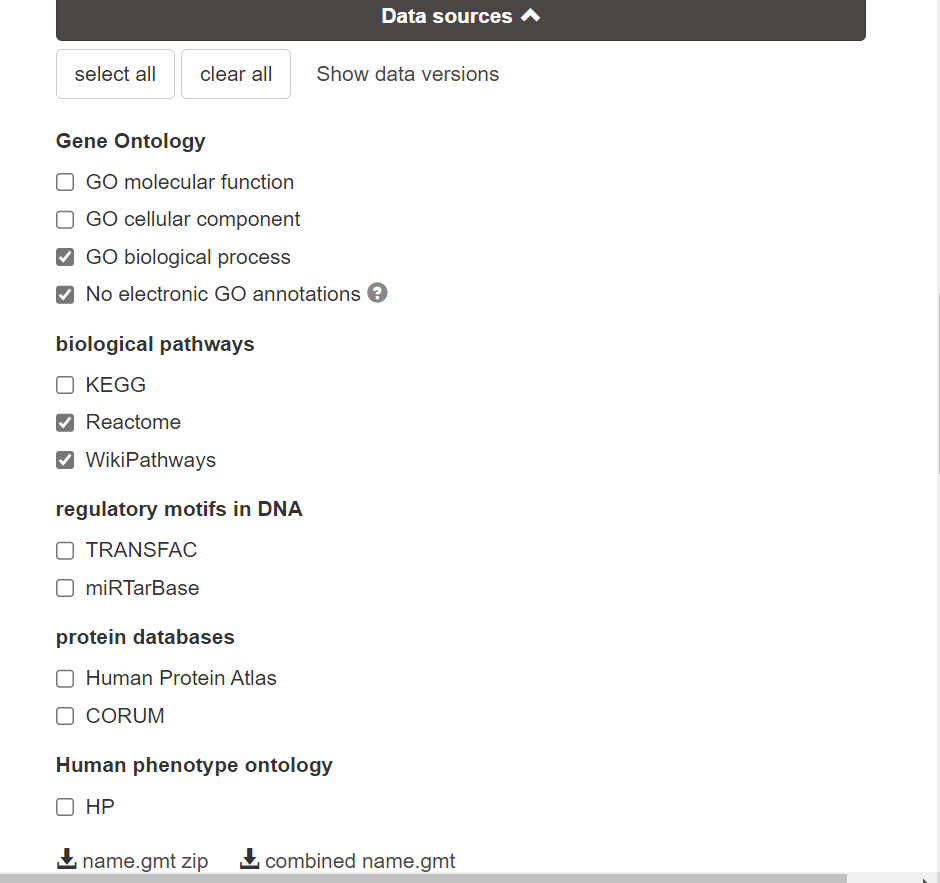
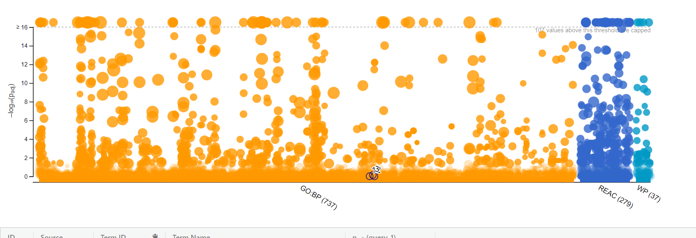
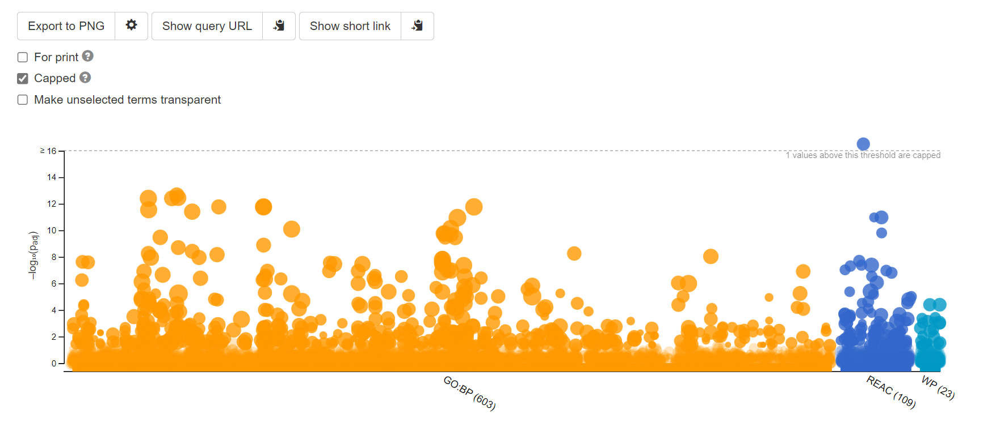
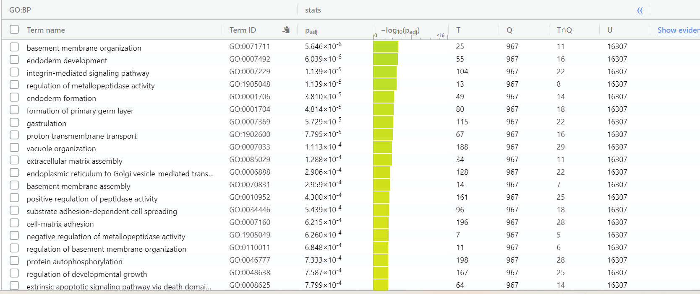
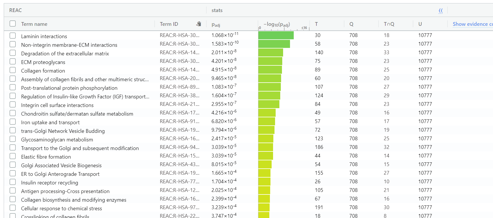
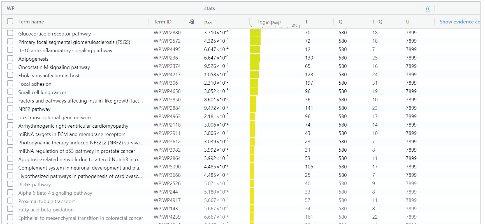
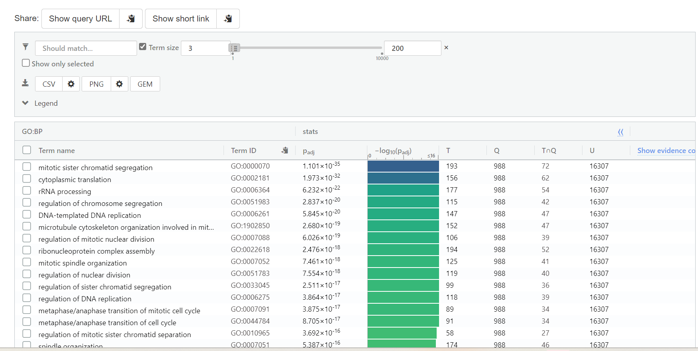
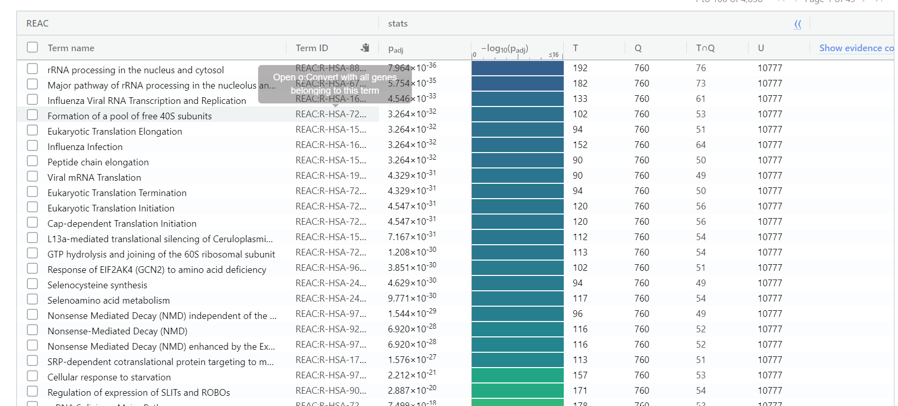
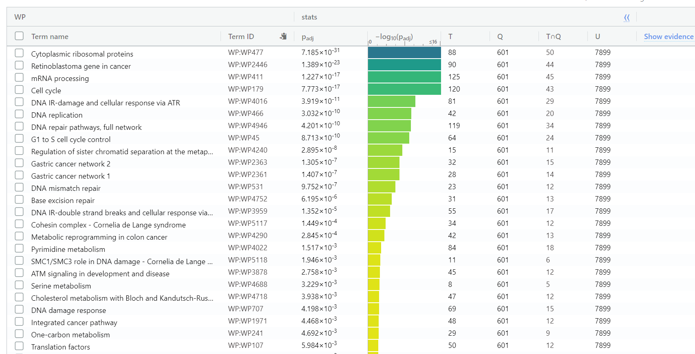

# Introduction

In the paper by Xu et.al., RNA processing events are described as transcription, mRNA splicing, and export.
In the cell, these RNA processing events are coordinated by the TREX complex.
The essential subunit of the TREX complex is DDX39B. The paper by Xu et.al. explores function of the DDX39B complex in handling damaged DNA.
The DDX39B complex facilitates DNA repair by up-regulating BRCA1 by binding to it, and stabilizing it. This	ensures ssDNA formation and RAD51 accumulation at the double stranded break sites.
Hence, the DDX39B complex handles damaged DNA by maintaining BRCA1 levels. 
<br/><br/>

Without DDX39B, ovarian cancer cells have hypersensitivity to DNA-damaging chemotherapeutic agents and are more likely to have damaged DNA.
High DDX39B expression is correlated with worst survival in ovarian cancer patients since it protects the cells from DNA damage by chemotheraputic agents. 
DDX39B suppression represents a target for enhancing the efficacy of chemotherapy in BRCA1-proficient ovarian cancers. The paper has found that lacking DDX39B is like lacking BRCA1 which prevents the cells from repairing their broken DNA. <br/><br/>

DDX39B depletion sensitizes cancer cells to DNA damaging agents including chemotherapy. The experiment in this paper used HeLA cells and performed Knockout of DDX39B complex genes on 3 knockout samples. The researchers then checked response to chemo agents. They discovered less survival in the knock out as compared to wild type cells. 
Following the loss of DDX39B, the researchers performed transcriptome profiles. They preformed mRNA sequencing in both wild-type and DDX39B knockout HeLa cells.
Among the genes that are regulated by DDX39B deficiency, 1483 genes were found to be upregulated and 1272 genes were down-regulated. Importantly, BRCA1, which is a key player in DNA damage repair, was significantly downregulated in DDX39B-depleted cells. 
The researchers also performed qPCR and western blot to confirm that both the mRNA and protein levels of BRCA1 were decreased in DDX39B knock out HeLa cells. Researchers also found that the regulation on BRCA1 is specific to DDX39B and no other DDX homologues.
<br/>
<br/>
All in all, these data suggest that DDX39B participates in DNA repair pathway via upregulating BRCA1 at the mRNA level. <br/><br/>

KO: DDX39B knockout genes <br/>
WT: wild type <br/>
<br/><br/>
 
 
```{r eval=FALSE}
if (!requireNamespace("BiocManager", quietly = TRUE))
    install.packages("BiocManager")
if (!requireNamespace("GEOmetadb", quietly = TRUE))
    BiocManager::install("GEOmetadb")
if(!requireNamespace("knitr", quietly=TRUE))
  install.packages("knitr")
if(! requireNamespace("edgeR", quietly=TRUE))
  BiocManager::install("edgeR")
if (!requireNamespace("GEOquery", quietly=TRUE))
  BiocManager::install("GEOquery")
if (!requireNamespace("biomaRt", quietly = TRUE)){
  install.packages("biomaRt")}
if (!require("BiocManager", quietly = TRUE))
    install.packages("BiocManager")
if (!require("stringr", quietly = TRUE))
    install.packages("stringr")
if (!require("dplyr", quietly = TRUE))
    install.packages("dplyr")

if (!require("Biobase", quietly = TRUE))
    install.packages("Biobase")

if (!require("kableExtra", quietly = TRUE))
    install.packages("kableExtra")
if( !file.exists("GEOmetadb.sqlite") ) {
    demo_sqlfile <- getSQLiteFile(destdir = getwd(), destfile = "GEOmetadb.sqlite.gz", type = "demo")
} else {
    demo_sqlfile <- "GEOmetadb.sqlite"
}
if (!require("magrittr", quietly = TRUE))
    install.packages("magrittr") # package installations are only needed the first time you use it

```

```{r eval=FALSE}
library(dplyr)
library(magrittr)
library(knitr)
library(Biobase)
library(GEOmetadb)
library(biomaRt)
library(ComplexHeatmap)
library(circlize)
library(edgeR)

``` 
 
# Assignment 1 Redo 

Since the data analysis performed in assignment 1 was not useful for the analysis 
in this assignment, the following section includes finding, cleaning, and Normalization of data. 

First, I downloaded the GEOmetaDB, and got access to the meta data:

## Download the data:
```{r message=FALSE}
#if the file exists, open it
fnames <- "GSE156543/GSE156543_Raw_gene_counts_matrix.txt.gz"

if (! file.exists(fnames)){
  gse <- GEOquery::getGEO("GSE117452", GSEMatrix=FALSE)
  sfiles = GEOquery::getGEOSuppFiles("GSE156543")
  fnames = rownames(sfiles)
}
```

## Geo Description of dataset:
```{r message=FALSE}
gse <- GEOquery::getGEO("GSE156543",GSEMatrix=FALSE)
data.frame(head(GEOquery::Meta(gse)))
knitr::kable(data.frame(head(GEOquery::Meta(gse))), format = "html")
```

Platform title:
```{r warning=FALSE}
current_gpl <- names(GEOquery::GPLList(gse))[1]
current_gpl_info <- GEOquery::Meta(GEOquery::getGEO(current_gpl))
```

**Platform title:** `r current_gpl_info$title`<br /> **Submission data:**`r current_gpl_info$submission_date` <br/> **Last Update data:** `r current_gpl_info$last_update_date` <br/> **Organism:** `r current_gpl_info$organism` <br/> **Number of GEO datasets using this technology:** `r length(current_gpl_info$series_id)` <br/> **Number of GEO samples that use this technology:**`r length(current_gpl_info$sample_id)`<br/>


## Getting the expression data 
```{r warning=FALSE}
DDX39B_exp = read.delim(fnames[1],header=TRUE, check.names = FALSE) 

knitr::kable(DDX39B_exp[1:5,], format = "html")


```

## Cleaning the data:
I have unique ensembl IDs, hence, I will not filter them.
```{r eval=FALSE}
dim(DDX39B_exp) 
#58381 rows, 6 col
colnames(DDX39B_exp) 
#(3 KO and 3 WT)
rownames(DDX39B_exp) 

```

```{r warning=FALSE}
if("ensemble_ID" %in% colnames(DDX39B_exp))
{
  ;
}else{
  DDX39B_exp <- tibble::rownames_to_column(DDX39B_exp, "VALUE")
  colnames(DDX39B_exp) <- c("ensemble_ID", "KO1", "KO2", "KO3", "WT1", "WT2", "WT3")

}

summarized_gene_counts <- sort(table(DDX39B_exp$ensemble_ID), decreasing = TRUE)
knitr::kable(table(DDX39B_exp[, 1])[1:3], format="html")

```


## Gene name structure
Removing genes that do not follow ensembl nomenclature

```{r warning=FALSE}
#check that all ensg are unique and all start with ENSG pattern 
areUniquegenes <- length(DDX39B_exp$ensemble_ID) == length(unique(DDX39B_exp$ensemble_ID))
allValidGenes <- length(grep("ENSG.*", DDX39B_exp$ensemble_ID)) == length(DDX39B_exp$ensemble_ID)


```


## Normalization

In edgeR, it is recommended to remove features without at least 1 read per million
in n of the samples, where n is the size of the smallest group of replicates.
```{r warning=FALSE}
#removing the versions  
DDX39B_exp <- tidyr::separate(DDX39B_exp, ensemble_ID, into = c("ensemble_ID", "Second"), "[.]")
DDX39B_exp <- DDX39B_exp[, -2]  
  
cpms = edgeR::cpm(DDX39B_exp[,2:7])
rownames(cpms) <- DDX39B_exp$ensembl_id
keep = rowSums(cpms > 1) >= 3 # I have 6 groups, 3 sample replicates and 3 WT replicates
genes_filtered <- DDX39B_exp[keep,]


dim(genes_filtered)
filtered_results <- data.frame(genes_expression = nrow(DDX39B_exp), validGenes = nrow(DDX39B_exp), genes_filtered = nrow(genes_filtered))
rownames(filtered_results)[1] <- "Number of Genes"

```

Dimension of data and filtered data.
Lots of the data has been filtered in the Normalization process following the edgeR guidlines. 
```{r warning=FALSE}
dim(cpms)
length(which(keep))
```


## Data distribution density plot: 
```{r warning=FALSE}
data2plot <- log2(edgeR::cpm(genes_filtered[,2:7]))
counts_density <- apply(log2(edgeR::cpm(genes_filtered[,2:7])), 
 2, density)
 #calculate the limits across all the samples
 xlim <- 0; ylim <- 0
 for (i in 1:length(counts_density)) {
 xlim <- range(c(xlim, counts_density[[i]]$x)); 
 ylim <- range(c(ylim, counts_density[[i]]$y))
 }
 cols <- rainbow(length(counts_density))
 ltys <- rep(1, length(counts_density))
 #plot the first density plot to initialize the plot
 plot(counts_density[[1]], xlim=xlim, ylim=ylim, type="n", 
 ylab="Smoothing density of log2-CPM", 
 main="Data Distribution Density Plot", cex.lab = 0.85)
 #plot each line
 for (i in 1:length(counts_density)) 
 lines(counts_density[[i]], col=cols[i], lty=ltys[i])
 #create legend
 legend("topright", colnames(data2plot), 
 col=cols, lty=ltys, cex=0.75, 
 border ="blue", text.col = "green4", 
 merge = TRUE, bg = "gray90")
```

Data distribution boxplot: 
```{r warning=FALSE}

data2plot <- log2(edgeR::cpm(genes_filtered[,2:7]))
boxplot(data2plot, xlab = "Samples", ylab = "log2 CPM", 
 las = 2, cex = 0.5, cex.lab = 0.5,
 cex.axis = 0.5, main = "Data Distribution Boxplot")
#draw the median on each box plot
abline(h = median(apply(data2plot, 2, median)), 
 col = "green", lwd = 0.6, lty = "dashed")
```

Plotting normalization by distribution method
```{r warning=FALSE}
limma::plotMA(log2(DDX39B_exp[,c(4,5)]), ylab="M - ratio log expression", 
 main="DDX39B KO vs WT sample")

```


## MDS plot of normalized data
```{r warning=FALSE}
filtered_data_matrix <- as.matrix(genes_filtered[,2:7])
rownames(filtered_data_matrix) <- genes_filtered$ensemble_ID
d <- edgeR::DGEList(counts=filtered_data_matrix)
d <- edgeR::calcNormFactors(d) 
normalized_counts <- edgeR::cpm(d)
limma::plotMDS(normalized_counts, main="MDS plot of DDX39B KO and WT"
 )
```


```{r warning=FALSE}
colnames(normalized_counts)
```

To perform mapping, ensembl_gene_id is selected

```{r warning=FALSE}
ensembl <- biomaRt::useMart("ensembl")
ensembl <- biomaRt::useMart(biomart="ensembl", dataset="hsapiens_gene_ensembl")
conversion_stash <- "DDX4_id_conversion.rds"
if(file.exists(conversion_stash)){
  my_id_conversion <- readRDS(conversion_stash)
} 
gene_mapped <- biomaRt::getBM(attributes = c("ensembl_gene_id","hgnc_symbol"), filters = c("ensembl_gene_id"), values=genes_filtered$ensemble_ID, mart = ensembl)
saveRDS(gene_mapped, conversion_stash)

```

```{r warning=FALSE}
genes_filtered$ensemble_ID[1:10]
```


Total number of genes with measurements
```{r warning=FALSE}
nrow(cpms)
```
Number of genes that could be mapped
```{r warning=FALSE}
nrow(cpms) - length(which(rownames(cpms) %in%
gene_mapped$ensembl_gene_id)) 
```


Merging raw data and mapped genes
```{r warning=FALSE}
cpms_annot <- merge(gene_mapped, normalized_counts,
by.x = 1, by.y = 0, all.y=TRUE)
```

Check ensembl ID missing genes. 43 genes missing which
is not too many. Hence, we can still run differential analysis.
```{r warning=FALSE}
length(ensembl_id_missing_gene <- cpms_annot$ensembl_gene_id[
which(is.na(cpms_annot$hgnc_symbol))])
```

```{r warning=FALSE}
write.table(cpms_annot,"./data/GSE156543_finalized_normalized_counts_2023.txt", sep = "\t", col.names = TRUE)


```

# Assignment 2 

## Differential Gene Expression: 

**Question 1: Revisit your MDS plot from Assignment #1 to demonstrate your choice of factors in your model.** <br/> 
From the MDS model denerated from A1, there is a clear distinction in the Knockout and the 
WildType cells. There is a clear separation between the two groups. Hence, the 
factors used in my model are having knock out of the DDX39B gene or being wild type.
From the MDS plot, there is evidence of the cluster of KO and WT which are the factors chosen in my model. 

<br/>


<br/>

Reading the normalized expression data from assignment 1
```{r warning=FALSE}
normalized_count_data <- read.table(file=file.path(getwd(),"data", 
                "GSE156543_finalized_normalized_counts_2023.txt"),
                                    header = TRUE,sep = "\t",
                                    stringsAsFactors = FALSE,
                                    check.names=FALSE)
```

Visualize expression values with heatmap
```{r warning=FALSE}
heatmap_matrix <- normalized_count_data[,
                        3:ncol(normalized_count_data)]
#Row name is Ensemble gene IDs
rownames(heatmap_matrix) <- normalized_count_data$ensembl_gene_id
colnames(heatmap_matrix) <- colnames(normalized_count_data[,
                        3:ncol(normalized_count_data)])
```


Row normalize with scale function
```{r message=FALSE}
library(circlize)
library(ComplexHeatmap)
heatmap_matrix <- t(scale(t(heatmap_matrix)))
if(min(heatmap_matrix) == 0){
    heatmap_col = colorRamp2(c( 0, max(heatmap_matrix)), 
                             c( "white", "red"))
  } else {
    heatmap_col = colorRamp2(c(min(heatmap_matrix), 0, 
          max(heatmap_matrix)), c("blue", "white", "red"))
  }
current_heatmap <- Heatmap(as.matrix(heatmap_matrix),
      show_row_dend = TRUE,show_column_dend = TRUE, 
      col=heatmap_col,show_column_names = TRUE, 
      show_row_names = FALSE,show_heatmap_legend = TRUE)
```

## Heat map for all genes in expression set
Variability at the WT vs KO. The WT and KO seem to have very different gene expression levels.
```{r warning=FALSE}
current_heatmap
```


Look at expression data and see difference of expression of the genes.
```{r warning=FALSE}
knock_out <- normalized_count_data[3:5]
Wild_type <- normalized_count_data[6:8]

```


Due to the very large difference in expression of the WT and KO genes, I used both limma and edgeR 
packages to perform analysis, and received the same results for my model.
```{r warning=FALSE}
samples <- c("KO", "KO", "KO", "control", "control", "control")
```

Expression is only controlled by WT or KO the origin of the cell does not effect my data as seen in MDS plot.
I will design my model matrix based on these two groups from my data.
```{r message=FALSE}
library(knitr)
model_design <- model.matrix(~ samples)
kable(model_design[1:5,], type="html")
```


```{r warning=FALSE}
expressionMatrix <- as.matrix(normalized_count_data[,3:8])
rownames(expressionMatrix) <- 
  normalized_count_data$ensembl_gene_id
colnames(expressionMatrix) <- 
  colnames(normalized_count_data)[3:8]
minimalSet <- Biobase::ExpressionSet(assayData=expressionMatrix)
```

Fit data to the model

### Limma analysis

```{r warning=FALSE}
fit <- limma::lmFit(minimalSet, model_design)
```

I then find the top hits for this expression, ordered according to p-value.
Then I perform differential expression associated with the p-values.
Finally, I will get all of the top hits associated with expression and 
use Benjamin Hoffberger method for adjustment. 

```{r warning=FALSE}
fit2 <- limma::eBayes(fit,trend=TRUE)
# adjust model for multiple hypothesis testing
topfit <- limma::topTable(fit2, 
                   coef="samplesKO",
                   adjust.method = "BH",
                   number = nrow(expressionMatrix))
#merge hgnc names to topfit table add ENSG and gen ID to output
output_hits <- merge(normalized_count_data[,1:2],
                     topfit,
                     by.y=0,by.x=1,
                     all.y=TRUE)
#sort by pvalue
output_hits <- output_hits[order(output_hits$P.Value),]
```

**Question 2: Multiple hypothesis testing - correct your p-values using a multiple hypothesis correction method. Which method did you use? And Why? How many genes passed correction?** <br/> 
The Benjamini-Hochberg method is a widely used method for multiple hypothesis correction as described in the paper by Benjamini et. al. It is used to control the false discovery rate when testing multiple hypotheses simultaneously.
The FDR is the expected proportion of false positives among all the significant results, and the Benjamini-Hochberg method controls this rate by adjusting the p-values for each hypothesis being tested. Specifically, the method sets a threshold for the p-values based on the FDR and rejects all null hypotheses with p-values below this threshold.
By controlling the FDR, the Benjamini-Hochberg method provides a way to account for the increased chance of false positives when testing multiple hypotheses, and helps to reduce the likelihood of making incorrect conclusions based on random chance.

Below is the top 10 hits, including the p-values, hgnc symbol names, logFC between WT and KO states
Avg expression, t-value for t-test, p-value, and adjusted p-value
```{r warning=FALSE}
kable(output_hits[1:10,2:8],type="html",row.names = FALSE)

```


**Question 3: Calculate p-values for each of the genes in your expression set. How many genes were significantly differentially expressed? What thresholds did you use and why?** <br/> 
  <br/>
 Almost all of the genes are differentially expressed between the KO and WT subgroups. Hence, since 
 the samples are very different and there is a lot of differential expression in the data, I will
 filter the output hits for more stringent adjusted p-values. I do this since I am looking for strongest signals so I need to define a more stringent signal to get those strongest signals. In order to bottleneck the 
 genes to those with the strongest signal, I used an adjusted p-value of 0.000000001. With this
 threshold, 1007 genes are significantly differentially expressed between the KO and WT genes.

Number of genes that pass the correction and are corrected for randomness
```{r}
length(which(output_hits$adj.P.Val < 0.000000001))

```

Heatmap for just significant differential expressed genes
```{r warning=FALSE}
#adjusted p-value less than 0.000000001
top_hits <- output_hits$ensembl_gene_id[
  output_hits$adj.P.Val < 0.000000001]
heatmap_matrix_tophits <- t(
  scale(t(heatmap_matrix[
    which(rownames(heatmap_matrix) %in% top_hits),])))
if(min(heatmap_matrix_tophits) == 0){
    heatmap_col = colorRamp2(c( 0, max(heatmap_matrix_tophits)), 
                             c( "white", "red"))
  } else {
    heatmap_col = colorRamp2(c(min(heatmap_matrix_tophits), 0,
      max(heatmap_matrix_tophits)), c("blue", "white", "red"))
  }
current_heatmap <- Heatmap(as.matrix(heatmap_matrix_tophits),
                           cluster_rows = TRUE,
                           cluster_columns = TRUE,
                               show_row_dend = TRUE,
                               show_column_dend = TRUE, 
                               col=heatmap_col,
                               show_column_names = TRUE, 
                               show_row_names = FALSE,
                               show_heatmap_legend = TRUE,
                               )
```


Keeping the WT and KO together.
```{r}
heatmap_matrix_tophits<- heatmap_matrix_tophits[, 
    c(grep(colnames(heatmap_matrix_tophits),
                          pattern = "WT"),
      grep(colnames(heatmap_matrix_tophits),
                          pattern = "KO"))]
if(min(heatmap_matrix_tophits) == 0){
    heatmap_col = colorRamp2(c( 0, max(heatmap_matrix_tophits)), 
                             c( "white", "red"))
  } else {
    heatmap_col = colorRamp2(c(min(heatmap_matrix_tophits), 0,
                    max(heatmap_matrix_tophits)), 
                    c("blue", "white", "red"))
  }
current_heatmap <- Heatmap(as.matrix(heatmap_matrix_tophits),
                           cluster_rows = TRUE,
                           cluster_columns = FALSE,
                               show_row_dend = TRUE,
                               show_column_dend = TRUE, 
                               col=heatmap_col,
                               show_column_names = TRUE, 
                               show_row_names = FALSE,
                               show_heatmap_legend = TRUE,
                               )
```

This is the heatmap only for the strongest signal genes. There is a very clear 
differential expression between the top hit genes.
```{r warning=FALSE}
current_heatmap
```


Since there seems to be a lot of significant differential expression from the plot, I performed the same significance testing above using edgeR for calculating differential Expression to ensure that my results are valid. Indeed, the edgeR 
evaluations gave me the correct results. 

### EdgeR analysis
```{r message=FALSE}
library(edgeR)
#setup edgeR object
d = DGEList(counts=filtered_data_matrix, group=samples)
#estimate dispersion
d <- estimateDisp(d, model_design)

#fit model
fit <- glmQLFit(d, model_design)


```

Perform differential expression to grab the top hits.
It is evident the the p-values are still very significant.
```{r warning=FALSE}
#Choose sample KO
#calculate differential expression
qlf.pos_vs_neg <- glmQLFTest(fit, coef='samplesKO')
kable(topTags(qlf.pos_vs_neg), type="html",row.names = FALSE)
```


Number of genes that pass 0.0000000000000000001 threshold to capture the most significant genes.
Again, I had to use stringent p-values since I had a lot of differentially expressed genes as was necessary 
performing this calculation using the limma package. This time, the number of genes that passed correction was
still above 1972 genes. 
```{r warning=FALSE}
qlf_output_hits <- topTags(qlf.pos_vs_neg,sort.by = "PValue",
                           n = nrow(normalized_count_data))
#number of genes that pass threshold p-value
length(which(qlf_output_hits$table$PValue < 0.0000000000000000001))

#number of genes that pass the correction
length(which(qlf_output_hits$table$FDR < 0.0000000000000000001))

```

I will again create a heatmap using QLF data this time. 
I am looking for the WT and KO top hit genes.
```{r warning=FALSE}
top_hits <- rownames(qlf_output_hits$table)[output_hits$P.Value<0.00000000000000001] 
heatmap_matrix_tophits <- t(
  scale(t(heatmap_matrix[which(rownames(heatmap_matrix) 
                               %in% top_hits),]))) 
heatmap_matrix_tophits<- heatmap_matrix_tophits[,
  c(grep(colnames(heatmap_matrix_tophits),pattern = "WT"),
    grep(colnames(heatmap_matrix_tophits),pattern = "KO"))]
if(min(heatmap_matrix_tophits) == 0){
    heatmap_col = colorRamp2(c( 0, max(heatmap_matrix_tophits)), 
                             c( "white", "red"))
  } else {
    heatmap_col = colorRamp2(c(min(heatmap_matrix_tophits), 0, 
                               max(heatmap_matrix_tophits)), 
                             c("blue", "white", "red"))
  }
current_heatmap <- Heatmap(as.matrix(heatmap_matrix_tophits),
                           cluster_rows = TRUE,
                           cluster_columns = FALSE,
                               show_row_dend = TRUE,
                               show_column_dend = FALSE,
                               col=heatmap_col,
                               show_column_names = TRUE, 
                               show_row_names = FALSE,
                               show_heatmap_legend = TRUE)
```

```{r warning=FALSE}
current_heatmap
```

Above is the visualization of the top hits using a heatmap. The conditions WT and KO cells
clearly cluster together with WT clearly having all the genes analysed differentially expressed
from the KO condition. 

Number of Upregulated genes: 1085
```{r warning=FALSE}
length(which(qlf_output_hits$table$PValue < 0.000000000000000001 
             & qlf_output_hits$table$logFC > 0))
```

Number of downregulated genes: 1098
```{r warning=FALSE}
length(which(qlf_output_hits$table$PValue < 0.000000000000000001 
             & qlf_output_hits$table$logFC < 0))
```


## Threshold ORA

I will now create threshold lists of genes:
I was to know if there are any gene sets or pathways that are enriched/over-represented or depleted/under-represented in my list. Hence, I will take significant and upregulated genes, and significant and downregulated genes.

From the by Xu et.al, it is expected that the KO cells have downregulation of the BRCA1 genes.
In fact, the BRCA1 is significantly downregulated in our data. 
```{r warning=FALSE}
#merge gene names with the top hits
qlf_output_hits_withgn <- merge(cpms_annot[,1:2],qlf_output_hits, by.x=1, by.y = 0)
#higher number the smaller p-value, + if upregulated, - if downregulated
qlf_output_hits_withgn[,"rank"] <- -log(qlf_output_hits_withgn$PValue,base =10) * sign(qlf_output_hits_withgn$logFC)
qlf_output_hits_withgn <- qlf_output_hits_withgn[order(qlf_output_hits_withgn$rank),]

upregulated_genes <- qlf_output_hits_withgn$hgnc_symbol[
  which(qlf_output_hits_withgn$PValue < 0.000000000000000001 
             & qlf_output_hits_withgn$logFC > 0)]

downregulated_genes <- qlf_output_hits_withgn$hgnc_symbol[
  which(qlf_output_hits_withgn$PValue < 0.000000000000000001 
             & qlf_output_hits_withgn$logFC < 0)]

both_d_u_genes <- qlf_output_hits_withgn$hgnc_symbol[
  which(qlf_output_hits_withgn$PValue < 0.000000000000000001)]

#write genes to a file
write.table(x=upregulated_genes,
            file=file.path("data","upregulated_genes.txt"),sep = "\t",
            row.names = FALSE,col.names = FALSE,quote = FALSE)

write.table(x=downregulated_genes,
            file=file.path("data","downregulated_genes.txt"),sep = "\t",
            row.names = FALSE,col.names = FALSE,quote = FALSE)

write.table(x=both_d_u_genes,
            file=file.path("data","both_d_u_genes.txt"),sep = "\t",
            row.names = FALSE,col.names = FALSE,quote = FALSE)

```


**Question 4: Which method did you choose and why?** <br/> 
I will perform Thresholded  ORA analysis on my significantly up-regulated and down-regulated set of genes.
There are multiple methods to perfom this task. I chose G:profiler because it is updated, has many annotations from ensembl (since my data is Ensembl, this method is useful), has a webserver as well as an R package, is 
for human data, uses Fischer exact test, and it is used to perform ORA analysis. Many methods are very similar to the G:profler method, but I used G:profiler due to the intuitive interface. 
<br/>


**Question 5: What annotation data did you use and why? What version of the annotation are you using?** <br/> 
For the analysis, I used the recommended GO biological process to have access to all of the biological processes, no electronic GO annotations were chosen since these data might not be up to date, Reactome, and wikipathways are also used for pathway analysis. I did not choose KEGG since it is subscription based, and the non-subscribed user will only get access to non-up to date data.<br/>

Version of the annotation is e108_eg55_p17_0254fbf, which is ensembl 108.
<br/>



<br/>

**Question 6: How many genesets were returned with what thresholds?** <br/> 
I downloaded the GEM files of the Upregulated and downregulated pathways and counted the number of genesets. The threshold chosen in g:profiler was 0.05 using Benjamin Hoffberger method for adjustment.
<br/>
I made the term size 3 to 200 so relevant genes are matched to the pathways.
<br/>

DownRegulated number of genesets: 6696 gene sets are downregulated.
```{r warning=FALSE}
down_genesets <- read.csv("data/g_profiler/down_regulated/gprofiler.csv", header = TRUE)

nrow(down_genesets)
```
Thresholds of all DownRegulated pathways are summarized in the table below:
```{r warning=FALSE}
threshold_down <- data.frame(down_genesets$adjusted_p_value)
knitr::kable(threshold_down[1:5,], format = "html")

```
<br/>


Upregulated gene sets:
7403  gene sets are upregulated.
```{r warning=FALSE}
up_genesets <- read.csv("data/g_profiler/up_regulated/gp2.csv", header = TRUE)

nrow(up_genesets)
```
Thresholds of all up_Regulated pathways:
```{r warning=FALSE}
threshold_up <- data.frame(up_genesets$adjusted_p_value)
knitr::kable(threshold_up[1:5,], format = "html")

```
<br/>

**Question 7: Run the analysis using the up-regulated set of genes, and the down-regulated set of genes separately. How do these results compare to using the whole list (i.e all differentially expressed genes together vs. the up-regulated and down regulated differentially expressed genes separately)?** <br/> 

All the differentially expressed genes together, result to more than 2000 genes, which cannot be handled by G:profiler. Hence, I did not use that in my analysis. However, the difference between the upregulated and down regulated genes are compared below:
<br/>

## ORA method using gene names

1. I Pasted content from upregulated_genes.txt (and later downregulated_genes.txt) to the G:profiler list of genes box. 
2. Under advanced options, I ensured to set the significance threshold to BH which is
what I used for correcting for multiple hypothesis testing. 
3. I chose all my results and not only the significant results
4. Under data sources for my initial pathway analysis, I chose pathways associated with GO by choosing the GO biological process, and No electronic GO annotations (to ensure get the best annotation results). I also chose Reactome and WikiPathways for my pathway database. 
5. Then, I ran query to run enrichment analysis.
6. I then Selected the Ensembl ID with the most GO annotations, and reran the query
7. Above the threshold line is considered very significant after collection and we can see the pathways. 
8. Under detailed results tab, shorten the term size from 3 to 200
9- I then Downloaded GEM file

For this downregulated dataset, I di not expect any important information since from the paper, I know that the downregulated data are most important.
<br/>
Using the downregulated dataset, many pathways were above the threshold in G:profiler as expected since in the paper
the downregulation of genes are mostly analysed. 
<br/>


Downregulated genes:

<br/>
<br/>

Up-regulated genes:

<br/>
<br/>


## Pathway analysis results:

### Upregulated genes:<br/>

The pathways associate with up-regulated genes has genes involved in basement memberane organization from the GO results with 11 of the upregulated genes being involved in that pathway, laminin interactions with 18 of the upregulated genes being involved in that pathway from the reactome analysis, and glucocorticoid receptor pathway with 18 of the genes from the up-regulated set being involved in that pathway from the wikipathways analysis, as the top hit.
<br/>
However, as evident from the paper, the genes of interest in this study are the down-regulated genes due to DDX39B knockout, which these genes should be involved in DNA repair. Hence, the pathways involved in up-regulation are not of much importance in my analysis as it is not the focus of the paper.
<br/>


<br/>


<br/>


<br/>

### Downregulated genes: <br/>

In the paper, they analyse the downregulation of genes upon the knockout of DDX39B gene. It is evident that the down-regulation results show that the these genes have correspondence to DNA repair and organization pathways as seen in the g-profiler results. From the GO results, there are 72 genes that are correspondent to mitotic sister chromatid segragation, from the reactome pathways, 76 downregulated genes are associated with rRNA processing in the nucleas, and from the wikipaths analysis, 50 genes are associated with cytoplasmic ribosomal proteins analysis in the top hits. These pathways are closely related to DNA repair pathways as predicted by the paper. The paper had hypothesized that the down-regulated genes are associated with the DNA repair pathways and indeed, these pathways mentioned in G-profiler are closely assosiated wit the DNA repair pathways. 


<br/>


<br/>


<br/>




<br/>


# Interpretation

Relating the results back to initial data and question:
<br/>

**Question 8: Do the over-representation results support conclusions or mechanism discussed in the original paper?** <br/> 
Yes, the over-representation results support the conclusions made in the paper by Xu et.al. As mentioned earlier, in the paper, they analyse the downregulation of genes upon the knockout of DDX39B gene. They saw that upon the knockout of DDX29B, many of the genes corresponding to the DNA repair pathway, including genes like BRCA1 are significantly downregulated. This means that the knockout of these genes will prevent the cell from being able to repair its damaged DNA, which make the cell vulnerable to chemotherapeutic agents. From our over-representation analysis using G:profiler, we found that the downregulated genes, were over-represented in the pathways that correspond to DNA repair and regulation which supports the mechanism discussed in the paper. 

All in all, it is evident that the down-regulation results show that the downregulated genes have correspondence to DNA repair and organization pathways. 
<br/>

**Question 9: Can you find evidence, i.e. publications, to support some of the results that you see. How does this evidence support your results?** <br/> 

In the paper by Chabalier et.al. they show that the downregualation of BRCA1 which is an improtant downregulated gene in the paper by Xu et. al. effects the chromosome related pathways including  inactivation of the spindlecheckpoint. This pathway is related to the mitotic sister chromatid segragation which is related to the inactivation of the spindle checkpoint as seen in the G:profiler resilts. Hence, the downregualted genes from my over-representation results do in fact show the downregulation of genes in a similar pathway as BRCA1 which have functions in DNA repair. 


# References

