# Introduction

In the paper by Xu et.al., RNA processing events are described as transcription, mRNA splicing, and export.
In the cell, these RNA processing events are coordinated by the TREX complex.
The essential subunit of the TREX complex is DDX39B. The paper by Xu et.al. explores function of the DDX39B complex in handling damaged DNA.
The DDX39B complex facilitates DNA repair by up-regulating BRCA1 by binding to it, and stabilizing it. This	ensures ssDNA formation and RAD51 accumulation at the double stranded break sites.
Hence, the DDX39B complex handles damaged DNA by maintaining BRCA1 levels. 
<br/><br/>

Without DDX39B, ovarian cancer cells have hypersensitivity to DNA-damaging chemotherapeutic agents and are more likely to have damaged DNA.
High DDX39B expression is correlated with worst survival in ovarian cancer patients since it protects the cells from DNA damage by chemotheraputic agents. 
DDX39B suppression represents a target for enhancing the efficacy of chemotherapy in BRCA1-proficient ovarian cancers. The paper has found that lacking DDX39B is like lacking BRCA1 which prevents the cells from repairing their broken DNA. <br/><br/>

DDX39B depletion sensitizes cancer cells to DNA damaging agents including chemotherapy. The experiment in this paper used HeLA cells and performed Knockout of DDX39B complex genes on 3 knockout samples. The researchers then checked response to chemo agents. They discovered less survival in the knock out as compared to wild type cells. 
Following the loss of DDX39B, the researchers performed transcriptome profiles. They preformed mRNA sequencing in both wild-type and DDX39B knockout HeLa cells.
Among the genes that are regulated by DDX39B deficiency, 1483 genes were found to be upregulated and 1272 genes were down-regulated. Importantly, BRCA1, which is a key player in DNA damage repair, was significantly downregulated in DDX39B-depleted cells. 
The researchers also performed qPCR and western blot to confirm that both the mRNA and protein levels of BRCA1 were decreased in DDX39B knock out HeLa cells. Researchers also found that the regulation on BRCA1 is specific to DDX39B and no other DDX homologues.
<br/>
<br/>
All in all, these data suggest that DDX39B participates in DNA repair pathway via upregulating BRCA1 at the mRNA level. <br/><br/>

KO: DDX39B knockout genes <br/>
WT: wild type <br/>
<br/><br/>
 
 
# Assignment 1 and 2 Recap

Initially, I downloaded the raw data for my analysis. I then cleaned and normalized the data. 
I also plotted an MDS plot for visualizing the control and knockout clustering. It is clear from the figure that the KO and WT samples cluster together. 

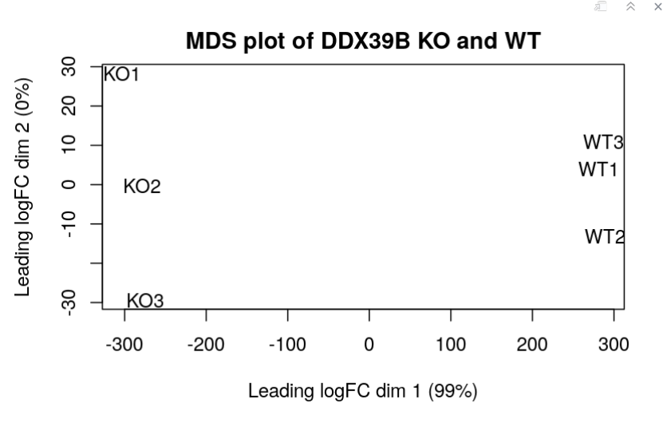
<br/>
**Figure 1:** MDS plot of normalised data from Assignment 1
<br/>
<br/>


I then read the data that was normalized and visualized the gene variability between the KO and WT samples using a heatmap. 

```{r warning=FALSE}
normalized_count_data <- read.table(file=file.path(getwd(),"data", 
                "GSE156543_finalized_normalized_counts_2023.txt"),
                                    header = TRUE,sep = "\t",
                                    stringsAsFactors = FALSE,
                                    check.names=FALSE)
```

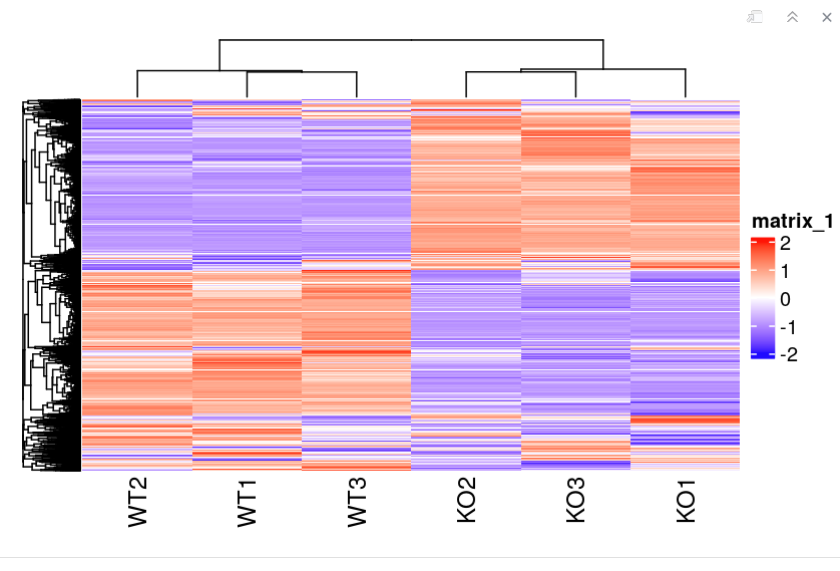
<br/>
**Figure 2:** Heatmap of WT and KO gene expression data set 
<br/>
<br/>

Variability at the WT vs KO. The WT and KO seem to have very different gene expression levels.

I also performed edgeR analysis of the data and found the ranks. 


```
qlf_output_hits_withgn[,"rank"] <- -log(qlf_output_hits_withgn$PValue,base =10) * sign(qlf_output_hits_withgn$logFC)
qlf_output_hits_withgn <- qlf_output_hits_withgn[order(qlf_output_hits_withgn$rank),]

qlf_output_hits_withgn <- qlf_output_hits_withgn[, c("hgnc_symbol", "rank")]
```
There results are written to the data directory in the file qlf_output_hits_withgn.txt.


From the over-representation results, we found that the over-representation results support the conclusions made in the paper by Xu et.al. As mentioned earlier, in the paper, they analyse the downregulation of genes upon the knockout of DDX39B gene. They saw that upon the knockout of DDX29B, many of the genes corresponding to the DNA repair pathway, including genes like BRCA1 are significantly downregulated. This means that the knockout of these genes will prevent the cell from being able to repair its damaged DNA, which make the cell vulnerable to chemotherapeutic agents. From our over-representation analysis using G:profiler, we found that the downregulated genes, were over-represented in the pathways that correspond to DNA repair and regulation which supports the mechanism discussed in the paper. 

All in all, it is evident that the down-regulation results show that the downregulated genes have correspondence to DNA repair and organization pathways. 
<br/>


In the paper by Chabalier et.al. they show that the downregualation of BRCA1 which is an improtant downregulated gene in the paper by Xu et. al. effects the chromosome related pathways including  inactivation of the spindlecheckpoint. This pathway is related to the mitotic sister chromatid segragation which is related to the inactivation of the spindle checkpoint as seen in the G:profiler resilts. Hence, the downregualted genes from my over-representation results do in fact show the downregulation of genes in a similar pathway as BRCA1 which have functions in DNA repair. 
<br/>


# Assignment 3


## Non-thresholded Gene set Enrichment Analysis

<br/>
**Question 1: What method did you use?** <br/> 

I used GSEA for my non-thresholded gene set enrichment analysis using the ranked set of genes.
<br/>

**Question 2: What genesets did you use? Make sure to specify versions and cite your methods.?** <br/> 
I downloaded Bader lab data it has the Reactome, Go, wikipathways, database gene sets which it pull regularly. So I will use these as me genesets because they are up to date.
I use the: Human_GOBP_AllPathways_no_GO_iea_March_02_2023_symbol.gmt
From the website https://download.baderlab.org/EM_Genesets/current_release/Human/symbol/.
These contain collection from March 1, 2021 containing GO biological process, no IEA and pathways.
<br/>


**Question 3: Summarize your enrichment results.How do these results compare to the results from the thresholded analysis in Assignment #2. Compare qualitatively. Is this a straight forward comparison? Why or why not?** <br/>

Since almost all of the genes from the dataset are differentially expressed, the patways from GSEA which 
uses FDR 0.25 does not provide meaningful pathways. I will plot my network to reduce the FDR values and get more significant results. 

However, I can identify significant gene sets by looking for gene sets that have a statistically significant enrichment score and a low p-value. These are the gene sets that are most likely to be biologically relevant.

From the pathways that I notice in the GSEA output results, in the like of downregulated genesets, the is very interesting. This pathway was analyzed in the paper by Xu et.al and was downregualted upon DDX39B knockout. Hence, this pathway as expected, is in the downregulated genesets. 
Additionally, other pathways related to telomere organization, double stranded breakage repair, and BRCA1 regualtion are in the downregulated genesets. Hence, this confirms the results from Xu et. al. that also saw downregualtion of these pathways upon knowckout of the DDX39B complex. 


## Visualize your Gene set Enrichment Analysis in Cytoscape
Cytoscape translates enrichment results to a network. 

**Question 4: Create an enrichment map - how many nodes and how many edges in the resulting map? What thresholds were used to create this map? Make sure to record all thresholds. Include a screenshot of your network prior to manual layout** <br/>

There are 208 nodes and 1994 edges in the emrichment map network. 

Used Scientific notation p-value 5e-08 to narrow down the pathways that are considered significant. 
A node is a gene set/pathway, and an edge is the similarity between the gene sets.  

Blue nodes: downregulated pathways, are seen to have associations with DNA repair as mentioned from the paper. The red nodes are upregulated and the pathway is not of significant interest as regards to our paper. 
For instance, the figure from the image below indicates that the downregulated genes in the blue nodes correspond to BRCA1 downregulation and DNA double strated repair as it was mentioned in the paper. 

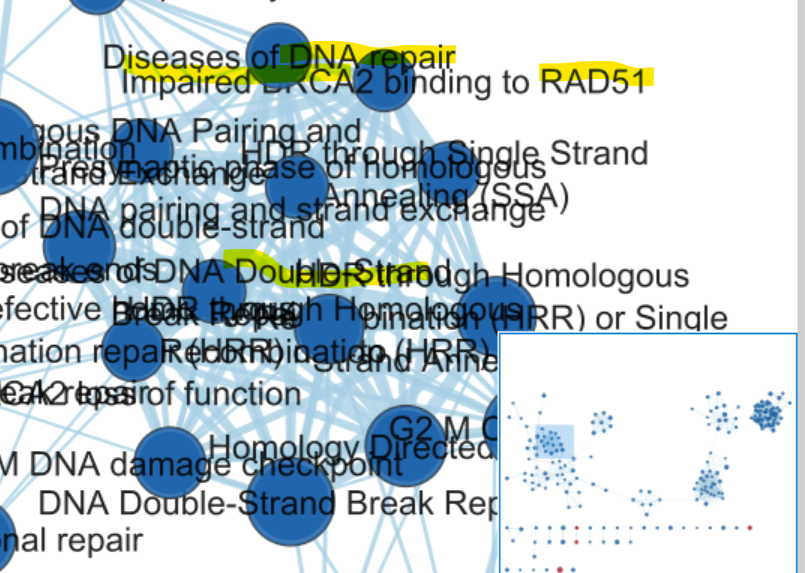
<br/>
**Figure 3:** Downregulated pathways annotated with genes that correspond to DNA repair as expected.
<br/>
<br/>

From the network results, it is evident that the up-regulated genes do not significantly map to the geneset pathways (as shown in the red nodes, there are only 3 pathways that are significantly upregulated from my gene set) and as expected, the down-regulated genes have many pathway nodes in the graph representation were the focus group of the study. 
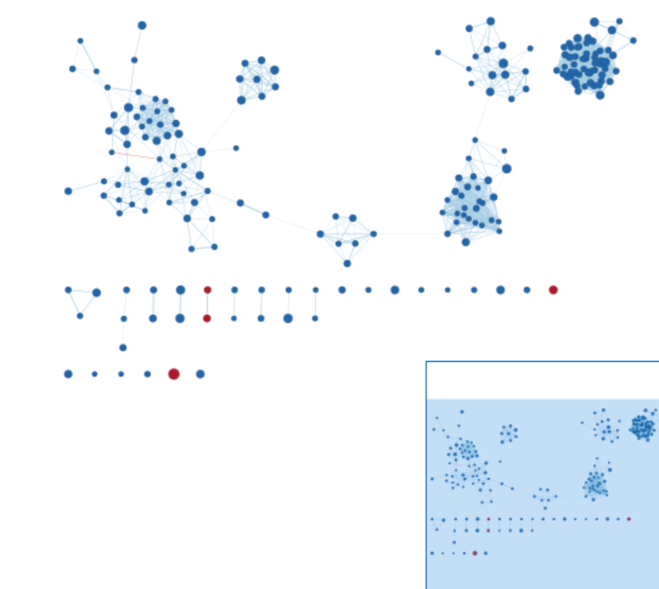
<br/>
**Figure 4:** Downregulated pathways The downregulated genesets are blue nodes and upregulated are red nodes
<br/>
<br/>

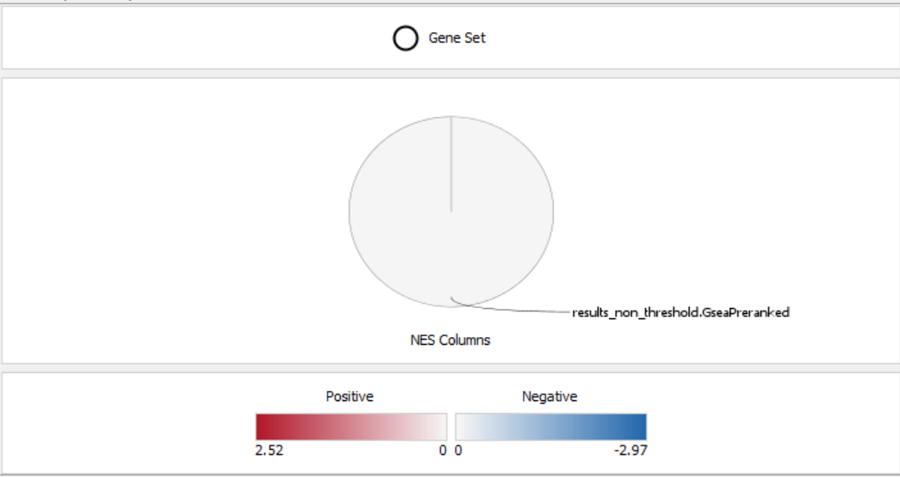
<br/>
**Figure 5:** Legend for pathways networkf in figure 4
<br/>
<br/>


**Question 5: Annotate your network - what parameters did you use to annotate the network. If you are using the default parameters make sure to list them as well.** <br/>
I will use default parameters: (From lecture notes)
- I use the size of the node corresponding to the size of the geneset
-colour of node corresponds to the phenotype and the p-value
-label of the node corresponds to the geneset description
-thickness of the edge corresponds to overlap statistic. The more genes two nodes have in common the thicker the edge (using overlap and Jaccard).

Leading edge genes are withing the enrichment that come before the max enrichment score. These drive this enrichment and make this set have a high score. Looking at leading edge genes.


**Question 6: Make a publication ready figure - include this figure with proper legends in your notebook.** <br/>

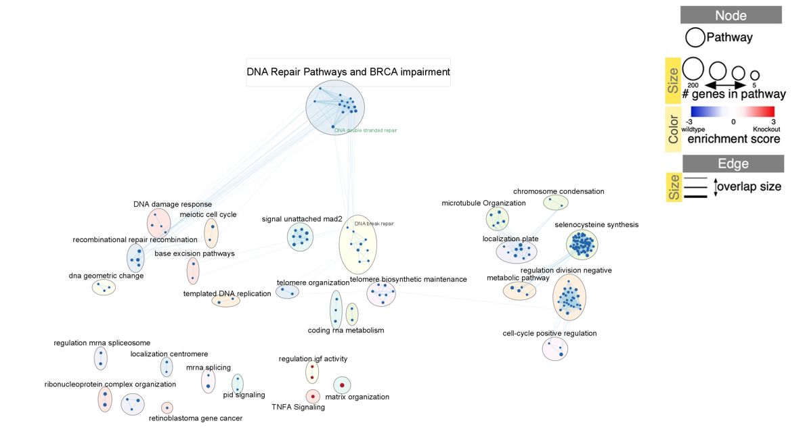
<br/>
**Figure 6:** Figure for the different gene sets analysed. The important pathway sets are highlighted with their names. The legend shows the desciption of the graph. The DNA repair pathway is represented by the top most cluster and the DNA doubple stranded pathway is highlighted with green text. 
<br/>
<br/>


**Question 7: Collapse your network to a theme network. What are the major themes present in this analysis? Do they fit with the model? Are there any novel pathways or themes?** <br/>

Some themes in the downregulated genes include telomere maintanence, template DNA replication, repair recombination. These are patway themes that are mentioned to be downregulated in the paper by Xu et. al. Hence, it is significant to see the group of downregulated pathways are shown to be related to the DNA repair pathway. 

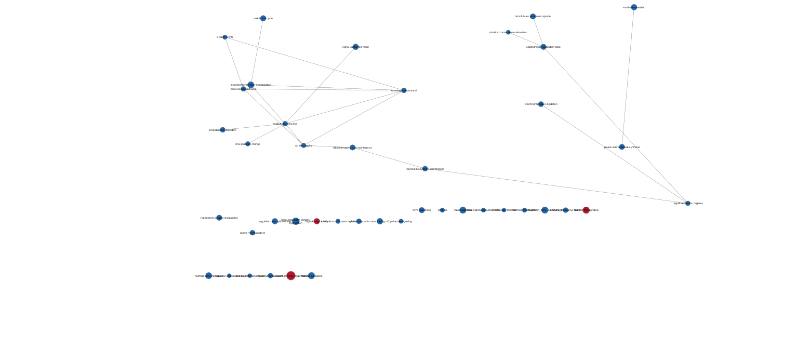
<br/>
**Figure 7:** Theme collapsed figure for the network
<br/>
<br/>


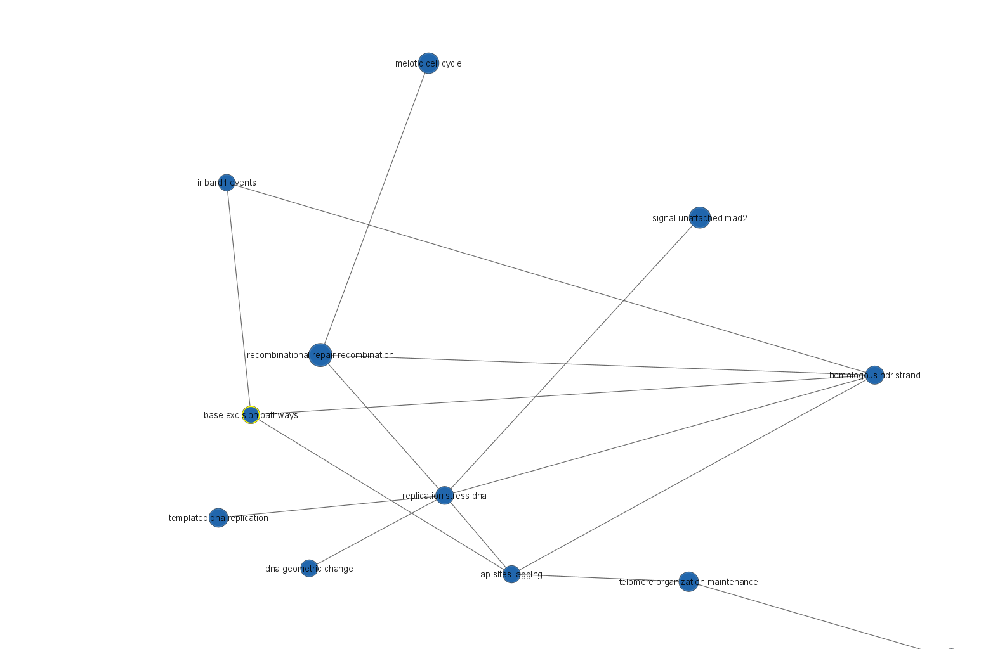
<br/>
**Figure 8:** Themes of interest are the donwregulated pathways relate to DNA repair. These pathways inclide base excision pathways, homologous hdr strand.Replication stress DNA, etc.
<br/>
<br/>


## Interpretation and detailed view of results
The most important aspect of the analysis is relating your results back to the initial data and question.

**Question 9: Do the enrichment results support conclusions or mechanism discussed in the original paper? How do these results differ from the results you got from Assignment #2 thresholded methods?** <br/>

Yes, the enrichment results follow closely with the mechanism discussed in the paper. It is evident that as discussed in the paper by Xu et.al., upon knockout of the DDX39B complex, DNA break repair pathways including BRCA1 binding will be down regulated. Hence preventing the fixation of the DNA upon breakage. From the enrichment analysis results, it is clear that the downregulated pathways correspond to genesets involved in DNA Double-Strand Break Repair pathway, BRCA binding with the DNA, DNA repair pathways, etc. which are all downregulated in the DDX39B knowckout samples. This also corresponds to the threshold methods in assignment 2 which the downregulated genes were again shown to be involved in DNA repair pathways. Hence, the paper, enrichment results, and threshold methods all convey the same information about the downregulated genes upon DDX39B KO. They all show the downregulation of DNA repair pathways and also downregulation of BRCA1 binding to the DNA.

**Question 10:Can you find evidence, i.e. publications, to support some of the results that you see. How does this evidence support your result?** <br/>

As mentioned in assignment 2, in the paper by Chabalier et.al. they show that the downregualation of BRCA1 affects the chromosome related pathways including  inactivation of the spindlecheckpoint. This pathway is related to the mitotic sister chromatid segragation which is related to the inactivation of the spindle checkpoint which is involved in DNA repair. Also, in the paper by Turan et. al., they found that the downregulation of BRCA1 reduced DNA repair pathways/ Hence, the downregualted genes from my over-representation and enrichment results do in fact show the downregulation of genes in a similar pathway as BRCA1, have significant functions in DNA repair. 

**Question 11:Choose a specific pathway or theme to investigate in more detail. Why did you choose this pathway or theme? Show the pathway or theme as a gene network or as a pathway diagram. Annotate the network or pathway with your original log fold expression values and p-values to show how it is effected in your model. (Hint: if the theme or pathway is not from database that has detailed mechanistic information like Reactome you can use apps like GeneMANIA or String to build the the interaction network.)** <br/>

I have chosen the  DNA Double-Strand Break Repair pathway which is the path number 5693532 on wikipathways. This pathway is very significant to my analysis because in the publication, the KO genes of the DDX39B complex cause a downregulation of the DNA Double-Strand Break Repair pathways. Specifically, the BRCA2 genes are downregualted. 

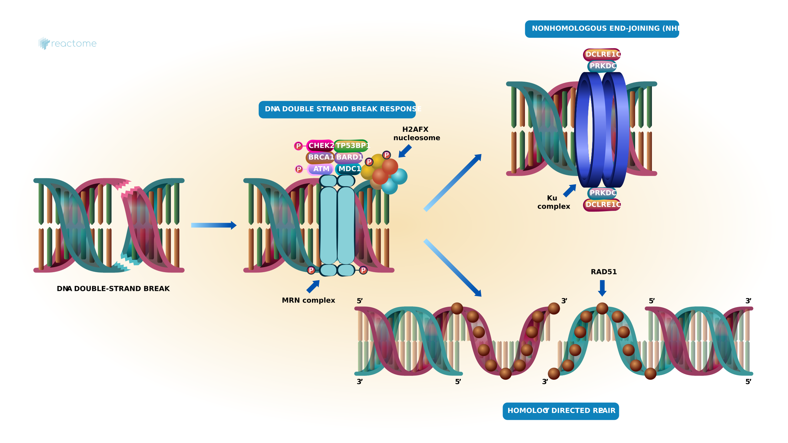
<br/>
**Figure 9:** Wikipathway DNA Double-Strand Break Repair pathway which is the path number 5693532 on wikipathways
<br/>
<br/>


From the geneMANIA view, overlapping the network pathway with the log expression values, BRCA1 is seen as downregulated in the pathway for DNA Double-Strand Break Repair pathway. This result again coincides with results from the paper which indicated that the KO of the DDX39B complex leads to the downregulated of the BRCA1 genes which effects the downregulated of DNA Double-Strand Break Repair pathway.

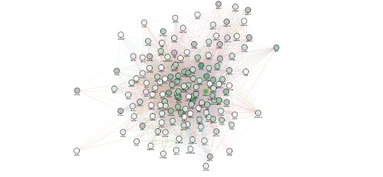
<br/>
**Figure 10:** GeneMania of the DNA Double-Strand Break Repair pathway overlayed with the rank data. BRCA1 is downregulated as seen in the figure, and is highlighted in Yellow.
<br/>
<br/>

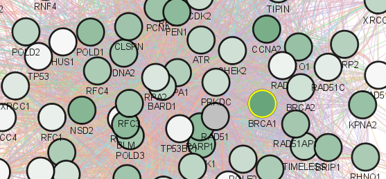
<br/>
**Figure 11:** Close up of GeneMania of the DNA Double-Strand Break Repair pathway overlayed with the rank data. BRCA1 is downregulated as seen in the figure. 
<br/>
<br/>

# References

<br/>
<br/>